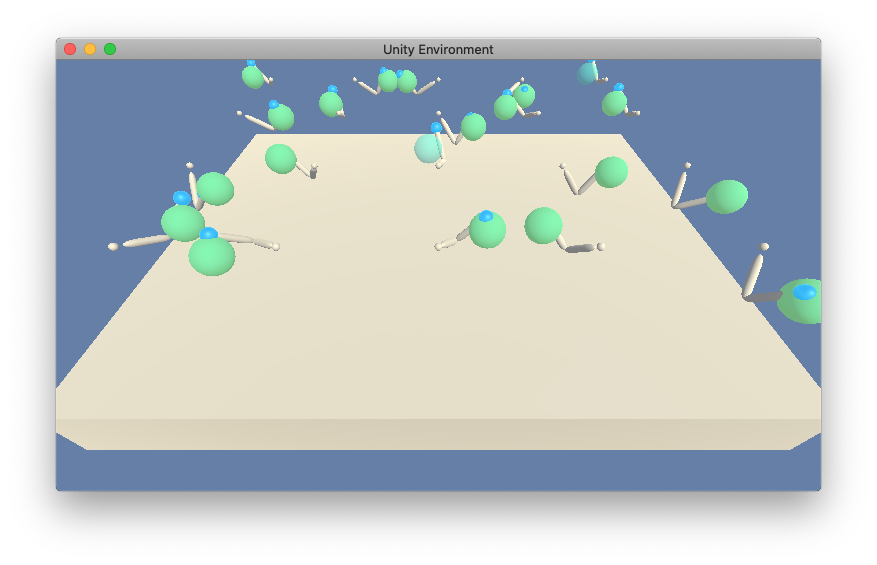

# Project 2: Continuous Control
### Project Details

This is my solution to Continuous Control Project of Udacity Deep Reinforcement
Learning course. Original project template is available at
https://github.com/udacity/deep-reinforcement-learning/tree/master/p2_continuous-control

In this environment, a double-jointed arm can move to target locations. A reward
of +0.1 is provided for each step that the agent's hand is in the goal location.
Thus, the goal of the agent is to maintain its position at the target location
for as many time steps as possible.

The observation space consists of 33 variables corresponding to position,
rotation, velocity, and angular velocities of the arm. Each action is a vector
with four numbers, corresponding to torque applicable to two joints. Every entry
in the action vector should be a number between -1 and 1.

The world contains 20 identical agents, each with its own copy of the
environment. The environment is considered solved, when the average over 100
episodes over all 20 agents at least +30.

Besides README.md, this repository holds of the following files:

* __Report.md__ provides a description of the implementation
* __test.py__ is the main file for testing
* __train.py__ is the main file for training
* __actor.pth__ is the Actor neural network trained parameters
* __critic.pth__ is the Critic neural network trained parameters
* __agent.py__ implements an agent for training and testing
* __env\_agent\_factory.py__ creates an environment and its agent
* __neural\_nets.py__ creates neural networks for an Actor and a Critic.
* __replay\_buffer.py__ implements a Replay Buffer 
* __*\_test.py__ unit tests of corresponding modules

All the Python code is pylint-compliant.

### Getting Started

Follow the steps, described in https://github.com/udacity/deep-reinforcement-learning/tree/dc65050c8f47b365560a30a112fb84f762005c6b README.md, Dependencies section, to deploy your development environment for this project.

Basically, you will need:

* Python 3.6
* PyTorch 0.4.0
* Numpy and Matplotlib, compatible with PyTorch
* Unity ML Agents. Udacity Navigation Project requires its own version of this environment, available https://github.com/udacity/deep-reinforcement-learning/tree/dc65050c8f47b365560a30a112fb84f762005c6b/python with references to other libraries

The project has been developed and tested on Mac OS Catalina with a CPU version of PyTorch 0.4.0, and in Udacity Workspace with a CUDA version of PyTorch.

### Instructions

1. Download the project to your PC
1. Open your terminal, cd to the project folder
1. Run __test.py__ to test previously trained agent over 100 episodes
1. Run __train.py__ to retrain the agent 
1. Look through __Report.md__ of this repository to learn further details about
my solution