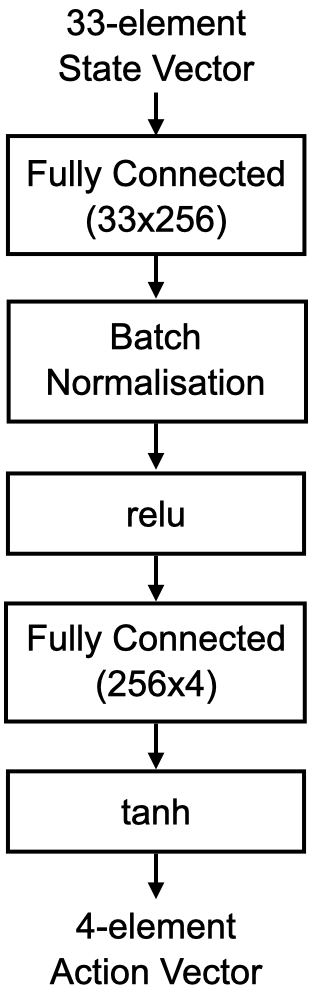
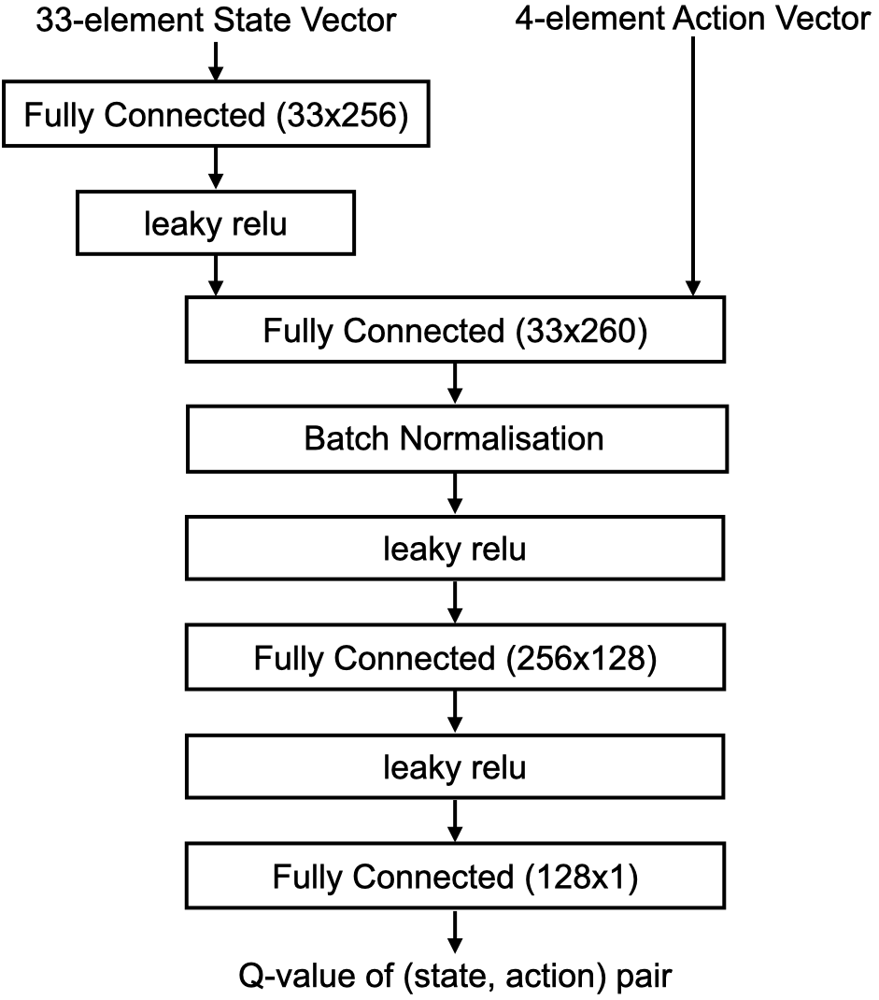
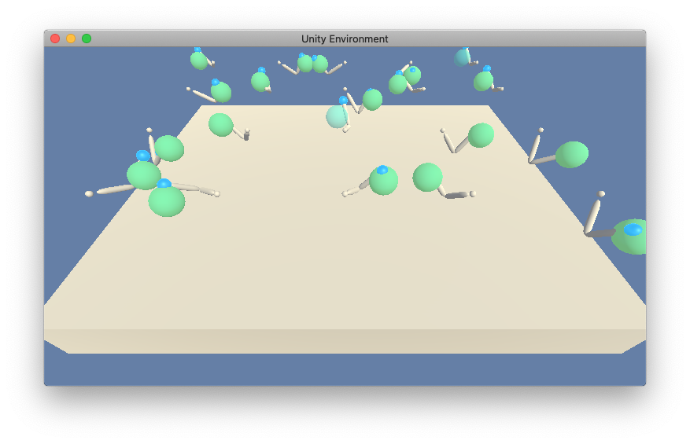
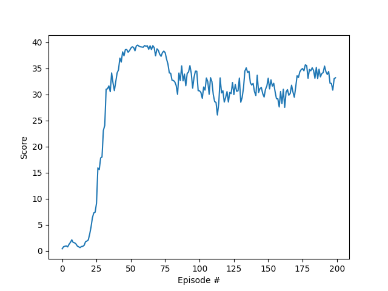

# Project 2: Continuous Control
### Learning Algorithm

The algorithm is based on a paper _Continuous control with deep reinforcement
learning by Lillicrap et al._ available at
<https://arxiv.org/pdf/1509.02971.pdf>. It describes Deep Deterministic Policy
Gradient algorithm, focused on learning agents to perform continuous
actions.

DDPG-agent consists of two parts: _Actor_ and _Critic_. An Actor suggests the
best action for the given state, and a Critic evaluates its cumulative score.

Actor is a neural
network that takes a state vector (in this project, consisting of 33 elements)
and returns an action vector (in this project, consisting of 4 elements).

TODO: The report clearly describes the learning algorithm, along with the chosen hyperparameters. It also describes the model architectures for any neural networks.

### Plot of Rewards

TODO: A plot of rewards per episode is included to illustrate that the agent is able to receive an average reward (over 100 episodes, and over all 20 agents) of at least +30.

TODO: The submission reports the number of episodes needed to solve the environment.

### Ideas for Future Work

* Try reverse reinforcement learning, when the achieved position of the arm is
used as if it were a planned goal point, which should accelerate the success
rate and thus training results

* Try "One Policy to Control Them All" approach, described in
https://arxiv.org/pdf/2007.04976.pdf, to use pre-trained policy network with
message-exchanging capabilities. Apply it to each torque action.

* Try TD(N) instead of Q-Learning and Prioritized Replay Buffer with
Distributed Q-Value to improve training results, which is a D4PG approach,
described in https://arxiv.org/pdf/1804.08617.pdf paper
