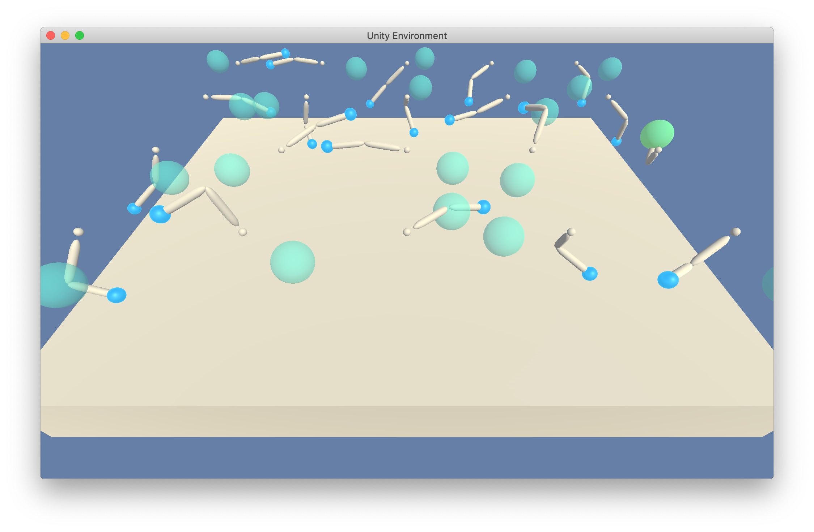

# Project 2: Continuous Control
### Learning Algorithm

The algorithm is based on a paper _Continuous control with deep reinforcement
learning by Lillicrap et al._ available at
<https://arxiv.org/pdf/1509.02971.pdf>. It describes Deep Deterministic Policy
Gradient (DDPG) algorithm, focused on learning agents to perform continuous
actions.

DDPG-agent consists of two neural networks, defined in __neural\_nets.py__: 
_Actor_ and _Critic_. An Actor suggests the best action for the given state,
and a Critic evaluates its cumulative score.

#### Actor

An Actor takes a state vector of 33 elements, encoding positions and velocities
of different joints of a robotic arm with ball coordinates, and produces 4
action values, corresponding to different torques of the arm.

State vector elements have different units. Some of their absolute values may
exceed 1.0, which is not good for a neural network training. To compensate for
this, an output of the first hidden layer is passed through a batch
normalization.

An attempt to apply the batch normalization directly to the input led to
underfitting and a low training score.

Action values must be in the range of [-1, 1]. To guarantee this, a hyperbolic
tangent activation function (tanh()) maps values from [-inf, inf] to [-1, 1] at
the output. Relu units are used in between other hidden layers.

The structure of the Actor network is shown in the picture below.


#### Critic

A Critic is a neural network that takes a state vector and an action vector to
produce one scalar output: a cumulative reward estimation of this (state,
action) pair.

At first, it accepts a state vector and passes it through a fully connected
layer and a leaky relu unit. Then it combines results with 4-element action
vector, passes through another fully connected layer and through the batch
normalization.

Batch normalization in the critic plays the same role as in the Actor, mainly
to normalize State vector values. However, attempts to apply it directly to
a state vector or a layer that immediately follows it led to poor training
results.

The initial architecture of the network was borrowed from ddpg-bipedal exercise
from <https://github.com/udacity/deep-reinforcement-learning/blob/master/ddpg-bipedal/model.py>
and adopted to this task with a trial and error.

The output of the Critic network is an estimated cumulative reward Q(state,
action). It is not bound by particular minimum and maximum. Therefore, it is
taken directly from the fully connected layer.

The structure of the Critic network is shown in the picture below.


#### Training the Agent

__train.py__ activates the training of the neural network. It creates an
agent, defined in __agent.py__, in a Unity environment through
__environment.py__.

The environment consists of 20 robotic arms, learning to follow a ball with a
gripper. Initially, untrained agents behave like shown in the picture below: 



As the training progresses, the agents maximize their cumulative rewards and
improve their scores:

```shell
python train.py

Episode 100	Average Score Over All Agents: 26.12 
Episode 200	Average Score Over All Agents: 31.74 
Saving actor.pth and critic.pth with score 34.21443923524768
```

In the end of training, agents consistently follow ball movements.


Actor and Critic neural network parameters are saved in __actor.pth__ and
__critic.pth__ files. You can replay the training results later with __test.py__
script:

```shell
python test.py

Episode 100	Average Score Over All Agents: 31.14 
Average Scores: 31.141209303939718
Last Scores: 31.82149928873405
```

In the beginning of __agent.py__, the following hyper-parameters are defined for
the training process:

```python
BUFFER_SIZE = int(1e6)  # replay buffer size
BATCH_SIZE = 128        # minibatch size
GAMMA = 0.99            # discount factor
TAU = 1e-3              # for soft update of target parameters
EPS_START = 1.0         # Initial noise scalar multiplier
EPS_END = 0.01          # Final noise scalar multiplier
EPS_DECAY = 0.99995     # Noise exponential rate
```

The values were initially borrowed from the DDPG paper or ddpg-bipedal exercise
and adjusted to produce best average score over 100 episodes over 20 agents.

It turned out that default Adam optimizer parameters work best for the current
project configuration. Custom learning rates for Actor, Critic and a weight 
decay, suggested by DDPG paper, fail the training procedure completely. So the
agent was unable to obtain the score of larger than 1.5.

```BUFFER_SIZE``` and ```BATCH_SIZE``` are properties of a Replay Buffer, which
memorizes at most a ```BUFFER_SIZE``` of ```(state, action, next_state, reward,
done)``` tuples from 20 agents to randomly sample a ```BATCH_SIZE``` of them for
a training step. This mechanism removes correlations between subsequent
experience, which leads to a better training.

In order to explore the world, Ornstein-Uhlenbeck process implemented by
```OUNoise``` class is used. It was originally designed to simulate a brownian
motion of a particle. In the project, it generates a sequence of exploratory
actions, which results in diverse robotic arm postures. A naïve Gaussian noise
would result in a trembling behavior, not exploring too much.

The amount of Ornstein-Uhlenbeck noise exponentially decays with each
step. This process is controlled by ```EPS_xxx``` hyperparameters. Thus, the
agent mainly explores the environment in the beginning; and exploits its
knowledge to maximize the score later in the training stage.

Neural networks of an Actor and a Critic are trained in ```Agent.__learn()```
method with a stochastic gradient descent as follows:

1. The Critic minimizes the discrepancy between an estimated cumulative reward and
estimated cumulative reward with Q-learning, given the current state and action

1. The Actor adjusts its action prediction so that it corresponds to a maximum
cumulative reward, estimated by the Critic  

Since both Critic and Actor are non-linear estimators, the process is subject to
high variance. In order to suppress it, the following preventive measures are
enforced:

* There are two neural networks for the Critic and two neural networks for the
Actor. While one neural network (with a ```_local``` postfix) is trained,
another one (with a ```_target``` postfix) calculates a cumulative reward
estimation from a current reward and a past experience. Then a local network
weights are slowly blended with a target network with an exponential filter and
TAU coefficient in ```_soft_update()``` function of __agent.py__.

* Every second training step is skipped to gather more experience, especially
in the initial phase of training

* Gradients of the critic network are clipped so as not to exceed the range of
[-1.0, 1.0]

### Plot of Rewards

The plot of an average total score over 100-episode window over 20 agents is
shown in the picture below. The agent achieves a score above +30.0 in
~130..140 episodes, which meets the passing criteria for this project.


The agent was trained on a CPU device of PyTorch library. The CUDA device will
likely to show different results, as it applies random seeds differently.

Actor-Critic DDPG method of training is very unstable. Its success dependents on
many strange and seemingly unrelated factors, including random seeds, obtained
through a blind trial an error rather than systematic theoretical analysis.

In my case, the following occasional discoveries allowed me to achieve
successful results after borrowing initial code from ddpg-bipedal exercise:

* Apply batch normalization to the output of the first hidden layer rather than
the input

* Use ```np.random.randn()``` instead of ```random.random()``` in
```OUNoise.sample()```, to generate both positive and negative exploration
actions based on a Gaussian noise. ```random.random()``` would produce uniform
non-Gaussian noise in the range of [0, 1].

* Use default Adam optimizer parameters. After removal of custom learning rates
and weighting decays, suggested by a DDPG paper or a ddpg-bipedal exersice, my
agent was able to learn much faster: from +1.5 maximum average score to 34.21

### Ideas for Future Work

* Try reverse reinforcement learning, when the achieved position of the arm is
used as if it were a planned goal point, which should accelerate the success
rate and thus training results

* Try "One Policy to Control Them All" approach, described in
https://arxiv.org/pdf/2007.04976.pdf, to use pre-trained policy network with
message-exchanging capabilities. Apply it to each torque action.

* Try TD(N) instead of Q-Learning and Prioritized Replay Buffer with
Distributed Q-Value to improve training results, which is a D4PG approach,
described in https://arxiv.org/pdf/1804.08617.pdf paper
